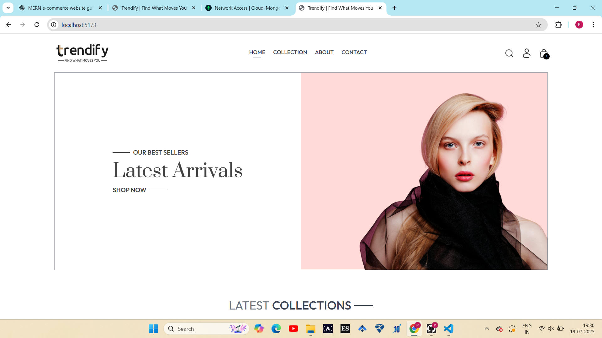
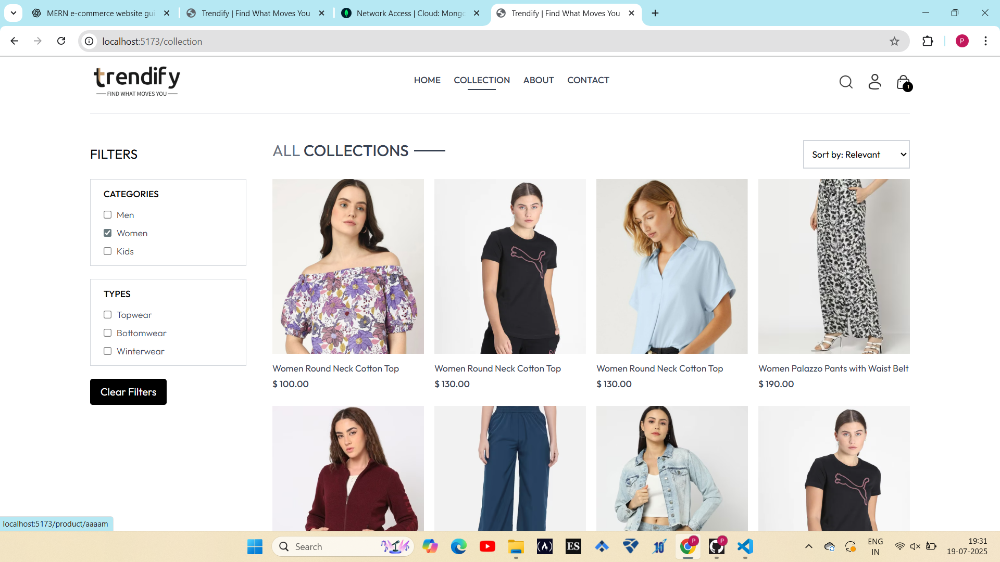
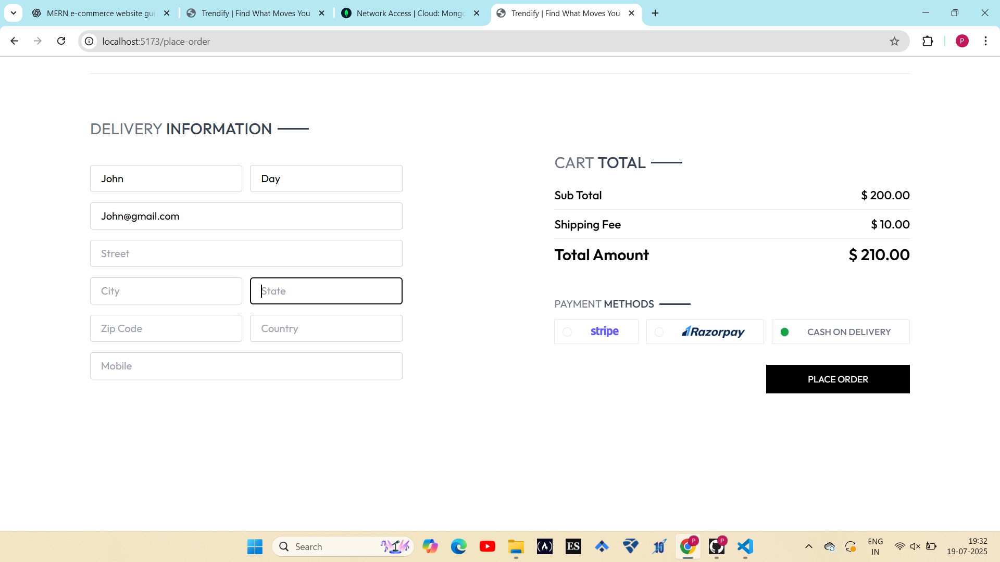

# 🛒 MERN E-Commerce Website

Welcome to the **MERN E-Commerce Website**! This project is a feature-rich e-commerce application built using the powerful MERN stack, complete with an intuitive user-facing store and an all-encompassing admin dashboard.

## ✨ Features

### 🌟 User Frontend:

- **🔒 Secure Authentication**: Register, login, and manage user profiles effortlessly.
- **🛍️ Product Exploration**: Browse and search through an extensive product catalog with advanced filtering options.
- **🛒 Shopping Cart**: Add products to your cart, modify quantities, and proceed to a hassle-free checkout.
- **💳 Seamless Payments**: Make secure payments using Stripe integration.
- **📦 Order Management**: View order history, track deliveries, and manage returns with ease.

### ⚙️ Admin Dashboard:

- **🛠️ Product Management**: Add, update, or delete products with a user-friendly interface.
- **📂 Category Management**: Organize products into categories for better navigation.
- **📑 Order Management**: View, process, and update orders efficiently.
- **👥 User Management**: Manage user roles and access levels.

## 🛠️ Tech Stack

- **MongoDB**: Robust NoSQL database for storing all application data.
- **Express.js**: Fast and minimalistic backend framework.
- **React.js**: Modern frontend library for building dynamic user interfaces.
- **Node.js**: JavaScript runtime environment for running the backend.
- **Stripe**: Integrated payment gateway for processing transactions.
- **JWT**: JSON Web Tokens for secure user sessions.
## 📸 Images

### 🏠 Home Page

 


### 🎭 Collections

 


### 🎟️ Payment

 

## 🗂️ Folder Structure

```plaintext
/
|-- admin/            # React.js admin frontend code
|-- backend/          # Node.js backend code (Express.js)
|-- frontend/         # React.js frontend code
|-- .gitignore        # Files and folders to be ignored by Git
|-- README.md         # Project documentation
```

## 🤸 Quick Start

Follow these steps to set up the project locally on your machine.

**Prerequisites**

Make sure you have the following installed on your machine:

- [Git](https://git-scm.com/)
- [Node.js](https://nodejs.org/en)
- [NPM](https://www.npmjs.com/) (Node Package Manager)


**Installation**

Install the project dependencies using npm:

```bash
npm install
```

**Set Up Environment Variables**

<details>
<summary><code>/admin/.env</code></summary>

```env
VITE_BACKEND_URL = "http://localhost:5000"
```

</details>

<details>
<summary><code>/backend/.env</code></summary>

```env
MONGODB_URI =

CLOUDINARY_API_KEY =

CLOUDINARY_SECRET_KEY =

CLOUDINARY_CLOUD_NAME =

JWT_SECRET =

ADMIN_EMAIL = "admin@trendify.com" #For testing only

ADMIN_PASSWORD = "admin@123" #For testing only

```

</details>

<details>
<summary><code>/frontend/.env</code></summary>

```env
VITE_BACKEND_URL = "http://localhost:5000"
```

</details>

Replace the placeholder values with your actual Appwrite credentials.

**Running the Project**

**Admin Dashboard Running On:**

```bash
cd admin
```

```bash
npm run dev
```

**Backend Running On:**

```bash
cd backend
```

```bash
npm run server
```

**Frontend Running On:**

```bash
cd frontend
```

```bash
npm run dev
```

